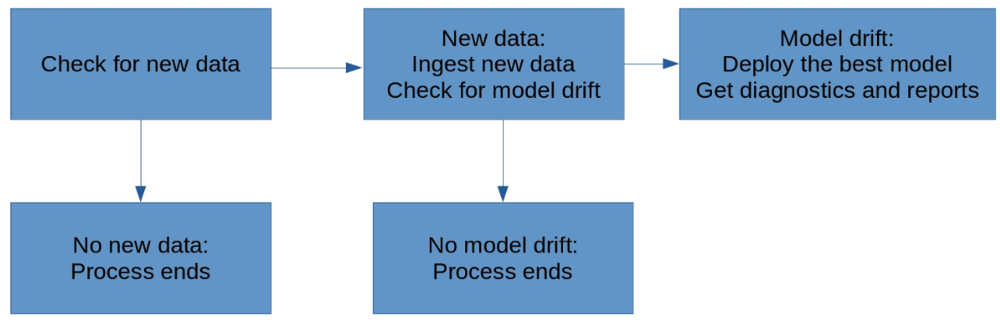

# Dynamic-Risk-Assessment-System
Imagine that you're the Chief Data Scientist at a big company that has 10,000 corporate clients. Your company is extremely concerned about attrition risk: the risk that some of their clients will exit their contracts and decrease the company's revenue. They have a team of client managers who stay in contact with clients and try to convince them not to exit their contracts. However, the client management team is small, and they're not able to stay in close contact with all 10,000 clients.

## Prerequisites
- Python 3 required

## Dependencies
This project dependencies is available in the ```requirements.txt``` file.

## Installation
Use the package manager [pip](https://pip.pypa.io/en/stable/) to install the dependencies from the ```requirements.txt```. Its recommended to install it in a separate virtual environment.

```bash
pip install -r requirements.txt
```

## Project Structure
```bash
📦Dynamic-Risk-Assessment-System
 ┣
 ┣ 📂data
 ┃ ┣ 📂ingesteddata                 # Contains csv and metadata of the ingested data
 ┃ ┃ ┣ 📜finaldata.csv
 ┃ ┃ ┣ 📜finaldata.csv
 ┃ ┃ ┗ 📜latestscore.txt
 ┃ ┣ 📂practicedata                 # Data used for practice mode initially
 ┃ ┃ ┣ 📜dataset1.csv
 ┃ ┃ ┗ 📜dataset2.csv
 ┃ ┣ 📂sourcedata                   # Data used for production mode
 ┃ ┃ ┣ 📜dataset3.csv
 ┃ ┃ ┗ 📜dataset4.csv
 ┃ ┗ 📂testdata                     # Test data
 ┃ ┃ ┗ 📜testdata.csv
 ┣ 📂model
 ┃ ┣ 📂models                       # Models pickle, score, and reports for production mode
 ┃ ┃ ┣ 📜apireturns.txt
 ┃ ┃ ┣ 📜confusionmatrix.png
 ┃ ┃ ┣ 📜latestscore.txt
 ┃ ┃ ┣ 📜summary_report.pdf
 ┃ ┃ ┗ 📜trainedmodel.pkl
 ┃ ┣ 📂practicemodels               # Models pickle, score, and reports for practice mode
 ┃ ┃ ┣ 📜apireturns1.txt
 ┃ ┃ ┣ 📜confusionmatrix1.png
 ┃ ┃ ┣ 📜latestscore.txt
 ┃ ┃ ┗ 📜trainedmodel.pkl
 ┃ ┗ 📂production_deployment        # Deployed models and model metadata needed
 ┃ ┃ ┣ 📜ingestedfiles.txt
 ┃ ┃ ┣ 📜latestscore.txt
 ┃ ┃ ┣ 📜encoder.pkl
 ┃ ┃ ┗ 📜trainedmodel.pkl
 ┃ ┃
 ┃ 📜apicalls.py                  # Runs app endpoints
 ┃ 📜app.py                       # Flask app
 ┃ 📜config.py                    # Config file for the project which depends on config.json
 ┃ 📜deployment.py                # Model deployment script
 ┃ 📜diagnostics.py               # Model diagnostics script
 ┃ 📜fullprocess.py               # Process automation
 ┃ 📜ingestion.py                 # Data ingestion script
 ┃ 📜pretty_confusion_matrix.py   # Plots confusion matrix
 ┃ 📜reporting.py                 # Generates confusion matrix and PDF report
 ┃ 📜scoring.py                   # Scores trained model
 ┃ 📜training.py                  # Model training
 ┃ 📜wsgi.py
 ┣ 📜config.json                    # Config json file
 ┣ 📜cronjob.txt                    # Holds cronjob created for automation
 ┣ 📜README.md
 ┣ 📜cron
 ┗ 📜requirements.txt               # Projects required dependencies
```

## Project Steps Overview
1. **Data ingestion:** Automatically check if new data that can be used for model training. Compile all training data to a training dataset and save it to folder. 
2. **Training, scoring, and deploying:** Write scripts that train an ML model that predicts attrition risk, and score the model. Saves the model and the scoring metrics.
3. **Diagnostics:** Determine and save summary statistics related to a dataset. Time the performance of some functions. Check for dependency changes and package updates.
4. **Reporting:** Automatically generate plots and PDF document that report on model metrics and diagnostics. Provide an API endpoint that can return model predictions and metrics.
5. **Process Automation:** Create a script and cron job that automatically run all previous steps at regular intervals.



## Usage

### 1- Edit config.json file to use practice data

```bash
"input_folder_path": "practicedata",
"output_folder_path": "ingesteddata", 
"test_data_path": "testdata", 
"output_model_path": "practicemodels", 
"prod_deployment_path": "production_deployment"
```

### 2- Run data ingestion
```python
cd src
python ingestion.py
```

### 3- Model training
```python
python training.py
```

###  4- Model scoring 
```python
python scoring.py
```

### 5- Model deployment
```python
python deployment.py
```
### 6- Run diagnostics
```python
python diagnostics.py
```

### 7- Run reporting
```python
python reporting.py
```
### 8- Run Flask App
```python
python app.py
```

### 9- Run API endpoints
```python
python apicalls.py
```

### 11- Edit config.json file to use production data

```bash
"input_folder_path": "sourcedata",
"output_folder_path": "ingesteddata", 
"test_data_path": "testdata", 
"output_model_path": "models", 
"prod_deployment_path": "production_deployment"
```

### 10- Full process automation
```python
python fullprocess.py
```
### 11- Cron job

Start cron service
```bash
sudo service cron start
```

Edit crontab file
```bash
sudo crontab -e
```
   - Select **option 3** to edit file using vim text editor
   - Press **i** to insert a cron job
   - Write the cron job in ```cronjob.txt``` which runs ```fullprocces.py``` every 10 mins
   - Save after editing, press **esc key**, then type **:wq** and press enter